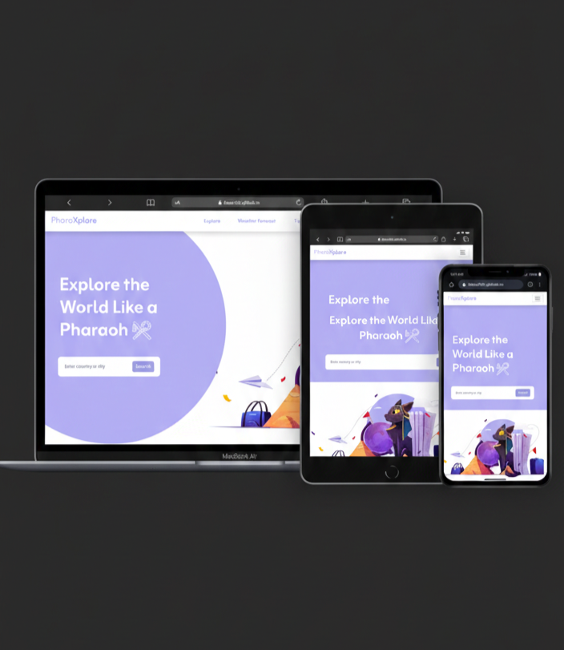

# 🗺️ PharoXplore

a Pharaoh-inspired global exploration platform, revealing countries, real-time weather, and world news through the eyes of ancient discovery.  

---

## 💡 Key Features:

🔹 Search for countries or cities to get detailed information including capital, region, languages, currency, and time zone 
🔹 Real-time 3-day weather forecasts using the WeatherAPI 
🔹 Top news headlines per country using NewsData API 
🔹 Fully responsive layout for mobile, tablet, and desktop 
🔹 Interactive UI cards with hover effects, badges, and dynamic text alignment for RTL/LTR languages 
🔹 Clean, modern design inspired by Egyptian pharaoh themes

---

## 🛠️ Tech Stack

- **HTML5**  
- **CSS3**  
- **Bootstrap 5**  
- **Responsive Design**
- **JavaScript (DOM manipulation, Event handling, API integration using async/await)**  
- **Google Fonts**  
- **Bootstrap Icons**

---

## 💻 GitHub Repo & Live Demo

🔗 **GitHub Repo:** [PharoXplore](https://github.com/Doaa182/Weather-App)  
🌐 **Live Demo:** [View on GitHub Pages](https://doaa182.github.io/Weather-App/)

---

## 👩‍💻 Author

**Doaa Diaa El Din**  
🔗 [GitHub Profile](https://github.com/Doaa182)

---
## 📸 Screenshot
 

